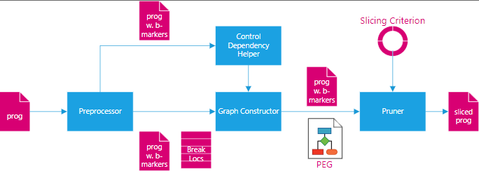

# Installation
```console
foo@bar:~/slicing$ npm i
foo@bar:~/slicing$ cd jalangi2
foo@bar:~/slicing/jalangi2$ npm i
foo@bar:~/slicing/jalangi2$ cd ..
# Run all unit tests
foo@bar:~/slicing$ npm test
...
(41 passing)
```
# Running milestone tests
In scripts subfolder run:
```console
foo@bar:~/slicing/scripts$ node testRunner.js --source ./milestone2_testCases.json
foo@bar:~/slicing/scripts$ node testRunner.js --source ./milestone3_testCases.json
```
# Running all tests (including mine)
In project root run:
```console
foo@bar:~/slicing$ npm test
```
# Slicer Structure

## Contents
| File  | Component | Description |
| ------------- | ------------- | ------------- |
| [runner.ts](slicer/runner.ts) | - |Invokes [preprocess.ts](slicer/preprocess.ts), then starts the Jalangi analysis [graph-constructor.ts](slicer/graph-constructor.ts) on the preprocessed file 
| [preprocess.ts](slicer/preprocess.ts) | Preprocessor | Transforms original program by adding break markers  |
| [control-deps.ts](slicer/control-deps.ts) | Control Depedency Helper | Statically find control dependencies induced by conditional branching |
| [graph-constructor.ts](slicer/graph-constructor.ts) | Graph Construcotr | Build Program Execution Graph (PEG) , invoke pruner when done |
| [graph-helper.ts](slicer/graph-helper.ts) | Graph Constructor | Node factory, adding nodes and edges to graph under construction. Used by [graph-constructor.ts](slicer/graph-constructor.ts) |
| [pruner.ts](slicer/pruner.ts) | Pruner | Given PEG and slicing criterion, find relevant locations and prune irrelevant ones by walking the AST of the transformed program. Then write out the sliced program.   |
| [datatypes.ts](slicer/datatypes.ts) | - | Datatypes |

